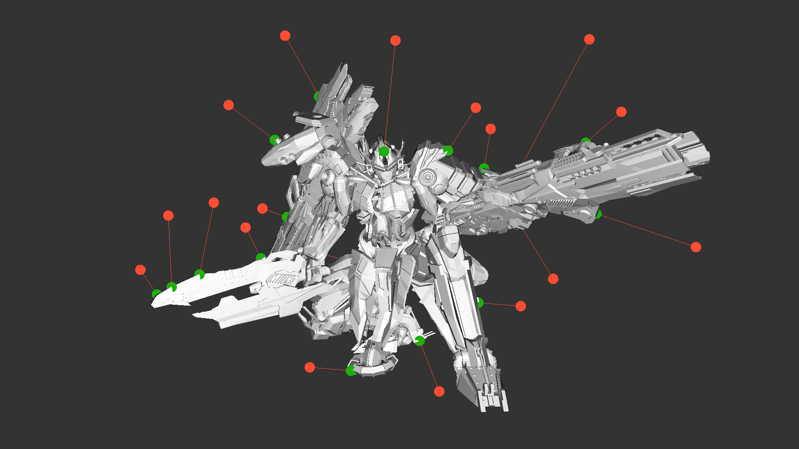
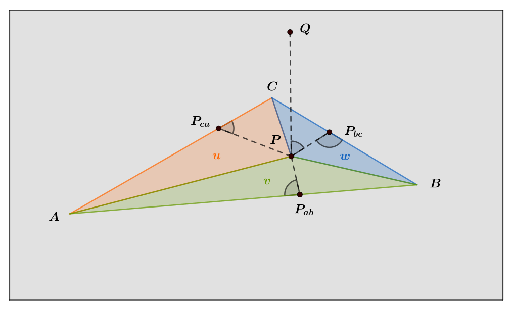
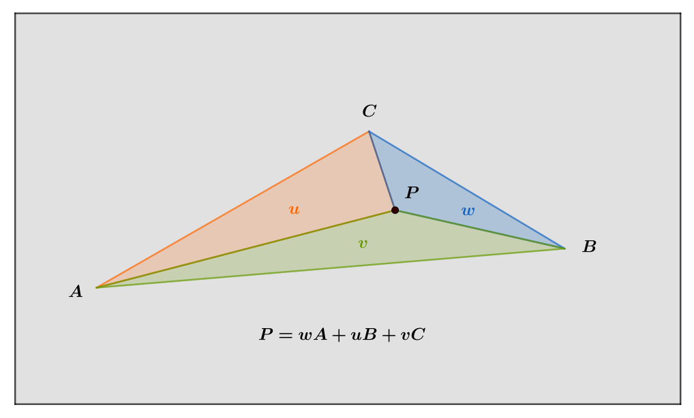
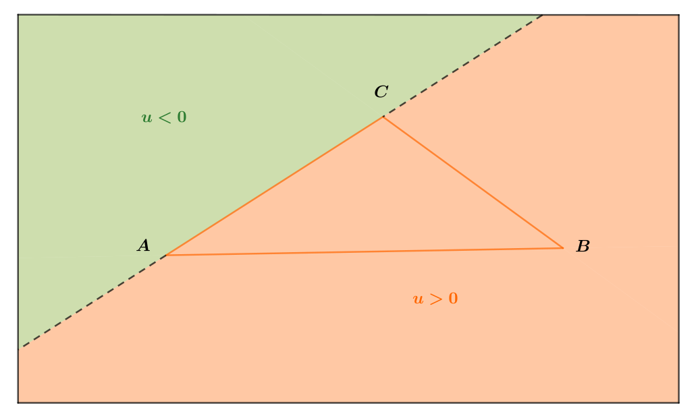
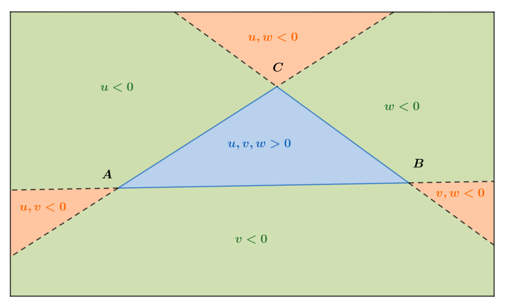
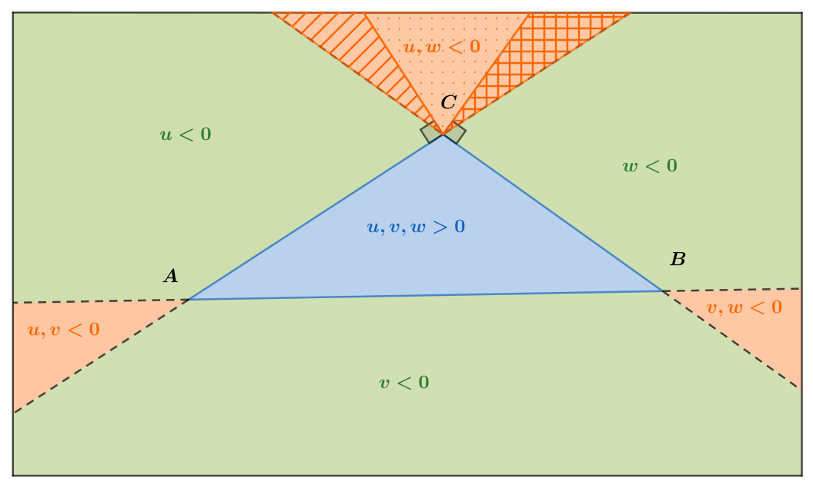
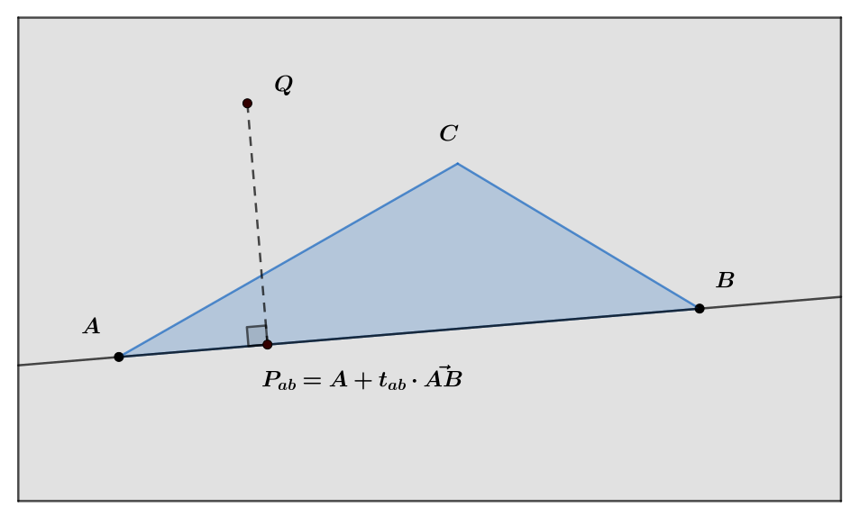
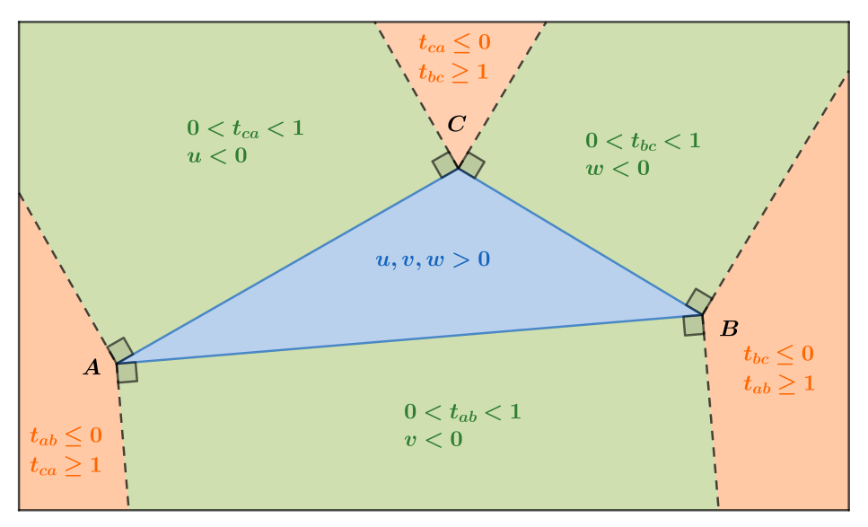

<!-- mathjax -->
<script src="https://polyfill.io/v3/polyfill.min.js?features=es6"></script>
<script type="text/javascript" id="MathJax-script" async src="https://cdn.jsdelivr.net/npm/mathjax@3/es5/tex-chtml.js"></script>
<style type="text/css">
    img[alt=image] { 
        display: block;
        margin-left: auto;
        margin-right: auto;
        width: 65%; 
        /*filter: hue-rotate(25deg);*/
    }
</style>

## Triangle closest point

Some 3D applications requires to compute the point on the surface defined by a triangulated mesh that is closest to a query point in space. 
At first glance, this may seem like an easy task, but in practice it is tricky.
<!-- Finding the closest point to a mesh is the same problem as finding the minimum distance between the mesh and the query point.  -->
On the example below, we processed several query points (in <span style="color: #ff6600">**orange**</span>) and their respective closest points (in <span style="color: #2e7d32">**green**</span>) on the mesh surface. 


<center>Shogun model courtesy of [Zeroswat](https://www.blendswap.com/profile/215926)</center>

One simple solution is to compute the closest points to every triangles in the mesh, and to keep the one that minimizes the distance from the query point. This method only requires the ability to find the closest point to a triangle, which we will cover in detail in this post. 
Although the linear search on every triangle works and does not cost further memory than the mesh itself, it is very inefficient on large meshes. 
One better approach consists in using an acceleration structure, such as a bounding volume hierarchy (BVH) or an octree, to quickly skip triangles that are to far from the query point. 
To learn more about bounding volume hierarchies, [Jakko Bikker](https://twitter.com/j_bikker) wrote a very comprehensive series of [blog posts](https://jacco.ompf2.com/2022/04/13/how-to-build-a-bvh-part-1-basics/) about them. 

Now we get some context, let's see how to compute the closest point to a triangle.

### Geometric configuration

Given a query point \\(\mathbf{Q}\\) in space, and a triangle defined by three vertices \\(\mathbf{A}\\), \\(\mathbf{B}\\) anc \\(\mathbf{C}\\), we want to find the point inside the triangle that is the closest to \\(\mathbf{Q}\\).
The closest point lies in the triangle plane and can be one of the following:

- equal to \\(\mathbf{A}\\),
- equal to \\(\mathbf{B}\\),
- equal to \\(\mathbf{C}\\),
- on the edge \\(\mathbf{AB}\\),
- on the edge \\(\mathbf{BC}\\),
- on the edge \\(\mathbf{CA}\\),
- inside the triangle \\(\mathbf{ABC}\\),

depending on the zone on which the query point is projected.

To compute the closest point we project the point \\(\mathbf{Q}\\) onto the triangle plane, and rely on edge projections (\\(\mathbf{P_{ab}}\\), \\(\mathbf{P_{bc}}\\),\\(\mathbf{P_{ca}}\\)) and barycentric coordinates (\\(\mathbf{w},\mathbf{u},\mathbf{v}\\)) of the projected point \\(\mathbf{P}\\) to find the closest point. 
Note that each marked angle below is a right angle.



### Barycentric coordinates

The barycentric coordinates of a point are the coefficients that expresses its location relative to the triangle vertices \\(\mathbf{A}\\), \\(\mathbf{B}\\) and \\(\mathbf{C}\\). 

Using a barycentric coordinate system a point \\(\mathbf{P}\\) in the triangle plane can be written as a linear combination of the triangle vertices: 

$$ \mathbf{P=w \cdot A+u \cdot B+v \cdot C}$$

where the sum of the coefficients is equal to one, \\(\mathbf{w+u+v = 1}\\). It is thus not necessary to compute \\(\mathbf{w}\\) explicitly, as \\(\mathbf{w=1-u-v}\\). This can be emphasized by rewriting the above equation relative to one origin vertex, for example \\(\mathbf{A}\\), and its two related edges \\(\mathbf{\vec{AB}}\\) and \\(\mathbf{\vec{AC}}\\):
$$
\begin{aligned}
\mathbf{P} & \mathbf{=(1-u-v) \cdot A+u \cdot B+v \cdot C} \\\ 
& \mathbf{=A+u \cdot (B-A)+v \cdot (C-A)} \\\ 
& \mathbf{=A+u \cdot \vec{AB}+v \cdot \vec{AC}}
\end{aligned}
$$


From a geometric point of view, the barycentric coordinates \\(\left(\mathbf{w},\mathbf{u},\mathbf{v}\right)\\) corresponds to the ratios of the signed areas that are bounded relative to point \\(\mathbf{P}\\):
$$
\begin{aligned}
& \mathbf{u=\frac{\text{SignedArea}\left(PCA\right)}{\text{SignedArea}\left(ABC\right)}} \\\ 
& \mathbf{v=\frac{\text{SignedArea}\left(PAB\right)}{\text{SignedArea}\left(ABC\right)}} \\\ 
& \mathbf{w=\frac{\text{SignedArea}\left(PBC\right)}{\text{SignedArea}\left(ABC\right)}}  
\end{aligned}
$$
Note that the barycentric coordinate calculations use the opposite edges of the vertex to which they refer, e.g. \\(\mathbf{u}\\) relates to vertex \\(\mathbf{B}\\) and therefore uses the edge \\(\mathbf{CA}\\). 
Signed area calculations also require the use of consistently oriented edges, e.g. counter-clockwise \\(\left(\mathbf{AB},\mathbf{BC},\mathbf{CA}\right)\\).

<!--  -->

#### Signs of barycentric coordinates

Due to the above formulation, the sign of a barycentric coordinate flip depending on which side of an edge the point \\(\mathbf{P}\\) is. For example below, if the point \\(\mathbf{P}\\) is in the <span style="color: #2e7d32">**green**</span> area its barycentric coordinate \\(\mathbf{u}\\) relative to vertex \\(\mathbf{B}\\) (or relative to the opposite edge \\(\mathbf{CA}\\)) is negative.
In fact, the triangles \\(\mathbf{ABC}\\) and \\(\mathbf{PCA}\\) have not the same orientation, one counter clockwise and the other clockwise, therefore their signed areas have opposite signs. 
Conversely if the point \\(\mathbf{P}\\) is in the the <span style="color: #ff6600">**orange**</span> area, that is the same as \\(\mathbf{B}\\), the barycentric coordinate \\(\mathbf{u}\\) is positive, as the triangles \\(\mathbf{ABC}\\) and \\(\mathbf{PCA}\\) have the same orientation.



This also extends to the two other coordinates \\(\mathbf{v}\\) relative to vertex \\(\mathbf{C}\\), and \\(\mathbf{w}\\) relative to vertex \\(\mathbf{A}\\). 

We thus observe that a point inside the triangle has three positive barycentric coordinates (<span style="color: #1565c0">**blue**</span> area), and that a point outside the triangle has either one (<span style="color: #2e7d32">**green**</span> areas) or two (<span style="color: #ff6600">**orange**</span> areas) negative barycentric coordinates. 
 


#### Projected barycentric coordinates

Note that we don't need to know the point \\(\mathbf{P}\\) to compute the projected barycentric coordinates of a point \\(\mathbf{Q}\\) in space. We instead compute \\(\mathbf{u}\\) and \\(\mathbf{v}\\) using some properties of the tetrahedral barycentric coordinates [**Heidrich05**] (because \\(\mathbf{ABCQ}\\) is a tetrahedron):

$$
\begin{aligned}
\mathbf{\vec{N}} &\mathbf{ =\vec{AB} \times \vec{AC} }\\\
\mathbf{u} &\mathbf{ =\frac{\left(\vec{CA} \times \vec{AQ}\right) \cdot \vec{N} }{N \cdot N} }\\\
\mathbf{v} &\mathbf{ =\frac{\left(\vec{AB} \times \vec{AQ}\right) \cdot \vec{N} }{N \cdot N} }\\\
\mathbf{w} &\mathbf{ =\frac{\left(\vec{BC} \times \vec{AQ}\right) \cdot \vec{N} }{N \cdot N} }\\\
\end{aligned}
$$

We can compute any pair of the three coordinates using the above equations and determine the third one implicitly, for example with \\(\mathbf{w=1-u-v}\\). 

#### Barycentric coordinates limitation

Note that in the geometric situation below the angle \\(\mathbf{\widehat{C}}\\) is obtuse. 
Therefore, given a point P in the <span style="color: #ff6600">**top orange**</span> area we can't determine whether the triangle closest point is \\(\mathbf{C}\\), on the edge \\(\mathbf{CA}\\) or on the edge \\(\mathbf{BC}\\) using its barycentric coordinates only. 


In fact, tracing the lines perpandicular to edges \\(\mathbf{CA}\\) and \\(\mathbf{BC}\\) passing by vertex \\(\mathbf{C}\\) let appear the three distinct areas, as depicted below:

- If the point \\(\mathbf{P}\\) is in the <span style="color: #ff6600">**orange hatched**</span> region, the closest point is on edge \\(\mathbf{CA}\\).
- If the point \\(\mathbf{P}\\) is in the <span style="color: #ff6600">**orange gridded**</span> region, the closest point is on edge \\(\mathbf{BC}\\).
- If the point \\(\mathbf{P}\\) is in the <span style="color: #ff6600">**orange dotted**</span> region, the closest point is \\(\mathbf{C}\\).



Thus, in the general case, computing the projected barycentric coordinates of a query point \\(\mathbf{Q}\\) is not sufficient to determine its closest point within a triangle. The orthogonal projection onto each edges are required to determine precisely in which region the point \\(\mathbf{P}\\) is.  

### Edge projection

To determine whether a point is closest to a triangle vertex or to an edge, we will rely on edge projection.
Given a point \\(\mathbf{Q}\\) in space, its orthogonal projection \\(\mathbf{P_{ab}}\\) on the edge \\(\mathbf{AB}\\) can be computed as follows:

$$
\begin{aligned}
\mathbf{P_{ab}} &\mathbf{ =A+t_{ab} \cdot \vec{AB} } \\\
&\mathbf{ =(1-t_{ab}) \cdot A+t_{ab} \cdot B }
\end{aligned}
$$

where \\(\mathbf{t_{ab}}\\) is the signed distance between \\(\mathbf{A}\\) and the projection \\(\mathbf{P_{ab}}\\), or the interpolation parameter on the line \\(\mathbf{\left(AB\right)}\\): 

$$
\mathbf{t_{ab} =\frac{\vec{AQ}\cdot\vec{AB}}{\vec{AB}\cdot\vec{AB}} }
$$



We can determine in which part of the line \\(\mathbf{AB}\\) a point \\(\mathbf{Q}\\) projects onto, using the value of the interpolation parameter:

- if \\(\mathbf{t_{ab}=0}\\), a point \\(\mathbf{Q}\\) projects to \\(\mathbf{A}\\)
- if \\(\mathbf{t_{ab}=1}\\), a point \\(\mathbf{Q}\\) projects to \\(\mathbf{B}\\)
- if \\(\mathbf{0< t_{ab} < 1}\\), a point \\(\mathbf{Q}\\) projects between \\(\mathbf{A}\\) and \\(\mathbf{B}\\)
- if \\(\mathbf{t_{ab}<0}\\), a point \\(\mathbf{Q}\\) projects before \\(\mathbf{A}\\)
- if \\(\mathbf{t_{ab}>1}\\), a point \\(\mathbf{Q}\\) projects after \\(\mathbf{B}\\)

<!--  -->

This properties extends to other edges \\(\mathbf{BC}\\) and \\(\mathbf{CA}\\), and can help us determine whether a point \\(\mathbf{P}\\) is closest to one of the triangle vertices or to an edge as we shall see next.

### Triangle closest point

Combining the three edge projections and the barycentric coordinates allows us to derive the necessary conditions to determine the closest point within a triangle, as illustrated below.



We first compute the interpolation parameters on each edges \\(\mathbf{AB}\\), \\(\mathbf{BC}\\) and \\(\mathbf{CA}\\). 
Then we can determine if a query point \\(\mathbf{Q}\\) is closest to one of the triangle vertices (<span style="color: #ff6600">**orange**</span> areas), by testing each pair of adjacent parameters as follows:

- if \\(\mathbf{t_{ab} \leq 0}\\) and \\(\mathbf{t_{ca} \geq 1}\\), the closest point to \\(\mathbf{Q}\\) is \\(\mathbf{A}\\).
- if \\(\mathbf{t_{bc} \leq 0}\\) and \\(\mathbf{t_{ab} \geq 1}\\), the closest point to \\(\mathbf{Q}\\) is \\(\mathbf{B}\\).
- if \\(\mathbf{t_{ca} \leq 0}\\) and \\(\mathbf{t_{bc} \geq 1}\\), the closest point to \\(\mathbf{Q}\\) is \\(\mathbf{C}\\).

Note that the edge orientation matters in the calculations (i.e. we use \\(\mathbf{CA}\\) to compute the projection and not \\(\mathbf{AC}\\)). 

Afterwards, we compute the projected barycentric coordinates of the query point. 
Then we can determine if a query point \\(\mathbf{Q}\\) is closest to one of the triangle edges (<span style="color: #2e7d32">**green**</span> areas)
We test both on which side of a an edge the query point projects to, and if the query point projects between the edge extremities (the interpolation parameter is in range:

- if \\(\mathbf{v < 0}\\) and \\(\mathbf{0 < t_{ab} < 1}\\), the closest point to \\(\mathbf{Q}\\) is its orthogonal projection on edge \\(\mathbf{AB}\\).
- if \\(\mathbf{w < 0}\\) and \\(\mathbf{0 < t_{bc} < 1}\\), the closest point to \\(\mathbf{Q}\\) is its orthogonal projection on edge \\(\mathbf{BC}\\).
- if \\(\mathbf{u < 0}\\) and \\(\mathbf{0 < t_{ca} < 1}\\), the closest point to \\(\mathbf{Q}\\) is its orthogonal projection on edge \\(\mathbf{CA}\\).

If all three barycentric coordinates are positive, the closest point to \\(\mathbf{Q}\\) is its orthogonal projection in the triangle, that is \\(\mathbf{P}\\). 


### Code

We provide the C++ functions that computes the closest point to a triangle next.

```c++
struct Triangle 
{
    // Vertices
    Point a, b, c;

    // Compute the barycentric coordinates of the point q projected onto the triangle plane. 
    // cf. Computing the Barycentric Coordinates of a Projected Point, Wolfgang Heidrich, 2005.
    void computeProjectedBarycentrics(const Point& q, float&u, float& v)
    {
        const Vector e1 = b - a;
        const Vector e2 = c - a;
        const Vector n = cross( e1, e2 );
        const float d = 1.f / dot( n, n );
        const Vector e3 = q - a;
        
        // implicit w=1-u-v
        u = dot( cross( e3, e2 ), n ) * d;
        v = dot( cross( e1, e3 ), n ) * d;
    }

    // Return the point whithin the triangle ABC that is the closest the query point q.
    Point closest(const Point& q)
    {
        // compute interpolation parameter on edge AB
        const Vector dab = b-a;
        const float tab = dot(queryPoint-a, dab)/dot(dab, dab);  
        // compute interpolation parameter on edge CA
        const Vector dca = a-c;
        const float tca = dot(queryPoint-c, dca)/dot(dca, dca);  
        // compute interpolation parameter on edge BC
        const Vector dbc = c-b;
        const float tbc = dot(queryPoint-b, dbc)/dot(dbc, dbc); 

        // test if closest point is A
        if( tca >= 1 && tab <= 0 )      return a;   
        // test if closest point is B
        else if( tab >= 1 && tbc <= 0 ) return b;   
        // test if closest point is C
        else if( tbc >= 1 && tca <= 0 ) return c;   

        // compute barycentric coordinates of the projected point
        float u, v, w;
        computeProjectedBarycentrics(queryPoint, u, v);
        w = 1.f-u-v;

        // test if closest point is on the edge CA
        if( v < 0 && tab > 0 && tab < 1 )      return a + tab * dab;    
        // test if closest point is on the edge AB
        else if( u < 0 && tca > 0 && tca < 1 ) return c + tca * dca;    
        // test if closest point is on the edge BC
        else if( w < 0 && tbc > 0 && tbc < 1 ) return b + tbc * dbc;    

        // else return interpolated closest point within the triangle
        return a + u*dab - v*dca; // saves 1 multiplication
    }
};
``` 


<!-- #### Bonus: triangle without obtuse angles

We showed that triangles having obtuse angles requires edge projections to determine the closest point precisely.
On the other hand, for triangles with angles only up to \\(\mathbf{\frac{\pi}{2}}\\) / \\(\mathbf{90°}\\), the barycentric coordinates are sufficient to find the closest point, because each area depicted below corresponds to one unique solution:

- if \\(\mathbf{P}\\) is in the <span style="color: #ff6600">**left orange**</span> area, the closest point is \\(\mathbf{A}\\)
- if \\(\mathbf{P}\\) is in the <span style="color: #ff6600">**right orange**</span> area, the closest point is \\(\mathbf{B}\\)
- if \\(\mathbf{P}\\) is in the <span style="color: #ff6600">**top orange**</span> area, the closest point is \\(\mathbf{C}\\)
- if \\(\mathbf{P}\\) is in the <span style="color: #2e7d32">**bottom green**</span> area, the closest point is on edge \\(\mathbf{AB}\\) (\\(\mathbf{A}\\) and \\(\mathbf{B}\\) included) 
- if \\(\mathbf{P}\\) is in the <span style="color: #2e7d32">**right green**</span> area, the closest point is on edge \\(\mathbf{BC}\\) (\\(\mathbf{B}\\) and \\(\mathbf{C}\\) included)
- if \\(\mathbf{P}\\) is in the <span style="color: #2e7d32">**left green**</span> area, the closest point is on edge \\(\mathbf{CA}\\) (\\(\mathbf{C}\\) and \\(\mathbf{A}\\) included)
- if \\(\mathbf{P}\\) is in the <span style="color: #1565c0">**blue**</span> area, the closest point is simply \\(\mathbf{P}\\)


```c++
// Returns the point on the line (o,e) that is the closest the query point q.
Point closestToLine(const Point& o, const Point& e, const Point& q) 
{
    // project point q onto line (o,e)
    Vector d = e-o;
    float t = dot(q-o, e-o)/dot(d, d); // avoid std::sqrt 
    
    // if proj=o+t*d is strictly between o and e, it is the closest to point q
    if( t > 0 && t < 1 ) return o + t * d;

    // if proj is beyond o or e, returns directly the closest extremity to ensure robustness
    return t <= 0 ? o : e;
}

// WARNING: this does not work with triangles containing obtuse angles, 
//          only works for triangles with angles up to 90°
Point closestToTriangleNoObtuse(const Point& a, const Point& b, const Point& c, const Point& q)
{
    // compute barycentric coordinates of the projected point
    float u, v;
    computeProjectedBarycentrics(q, u, v);

    // if one of the barycentric coordinate is negative, the closest point is on an edge
    if( u < 0.f )        return closestToLine(c, a, q);  // closest point is on the edge CA
    else if( v < 0.f )   return closestToLine(a, b, q);  // closest point is on the edge AB
    else if( u+v > 1.f ) return closestToLine(b, c, q);  // closest point is on the edge BC

    // else return interpolated closest point within the triangle
    return u*b + v*c + (1.f-u-v)*a;
}
``` -->

### References

[**Heidrich05**]: *Computing the Barycentric Coordinates of a Projected Point*, **Wolfgang Heidrich**, 2005