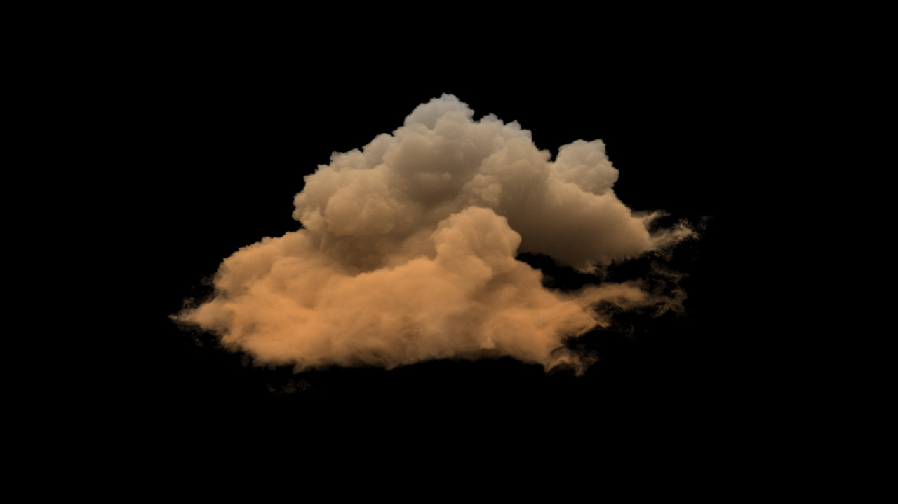
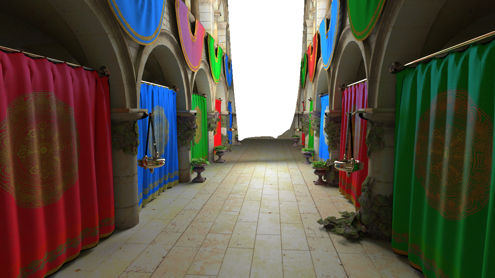

---
markdown_extensions:
    - pymdownx.highlight:
        noclasses": true
        pygments_style": "manni"
---

<!-- mathjax -->

# Rendering engine

This page provides some details on my personal academic rendering engine, started and improved over the course of my PhD, and continued for my current research and learning projects. The core source code is composed of 35000 lines of C++, it has been used to render thousands of hours of images and all figures from my academic publications, and used on various machines including the compute cluster [IN2P3](https://cc.in2p3.fr/en/).
Unfortunately the codebase is not public yet due to two reasons: some unpublished work implemented in it and a lazyness in the code quality that makes some part of it obfuscated. Below are the list of features it includes and some renders produced by the renderer.
However, [a small portion](https://diglib.eg.org/bitstream/handle/10.1111/cgf14481/minimvpt.zip?sequence=2&isAllowed=y) of it has been separated and published alongside my publication [Volumetric multi-view rendering](../eg2022/index.html).

## Features

It includes the following list of features:

- Integrators
    - Unidirectional volumetric path tracing integrator (vpt) [[Miller:2019]](#Miller2019)
    - Multiple view volumetric path tracing integrator (mvpt) and its adaptive version (amvpt) [[Fraboni:2021]](#Fraboni2021)
    - Multiple view path tracing integrator (extended to volumetric support for comparisons) [[Fraboni:2019]](#Fraboni2019)
    - Miscellaneous: Ambient occlusion, Normal, Light tracing, Path tracing, DoF supersampling integrator, Discrete path reusing integrator (surfaces only) [[Bekaert:2002]](#Bekaert2002)
- Materials
    - smooth models: diffuse reflection/transmission, conductor, dielectric with absorption, plastic with absorption, bi-layered model (coating and substrate) with absorption
    - rough models: diffuse reflection/transmission, conductor, dielectric with absorption, plastic with absorption, bi-layered model (coating and substrate) with absorption
    - microfacet models Beckmann and GGX
    - energy compensation [[Turquin:2017]](#Turquin2017)[[Kulla:2017]](#Kulla2017)
    - mix BSDF
    - thin film interferences
    - BSDF validation methods [[Heitz:2014]](#Heitz2014a)
    - BSDF similarity methods [[Fraboni:2021]](#Fraboni2021)
    - Roughness regularization [[Kaplanyan:2013]](#Kaplanyan2013)[[Jendersie:2019]](#Jendersie2019)
- Direct illumination techniques
    - BSDF sampling 
    - Next event estimation [[Shirley:1994]](#Shirley1994)
    - Equiangular sampling [[Kulla:2012]](#Kulla2012)
    - Light tree importance sampling (diffuse + approximate specular) [[Conty:2018]](#Conty2018) [[Yuksel:2019]](#Yuksel2019) [[Lin:2019]](#Lin2019) 
    - Multiple Importance Sampling [[Veach:1995]](#Veach1995)
    - RIS with CDF inversion or reservoirs (ReSTIR) [[Talbot:2005]](#Talbot2005)[[Bitterli:2020]](#Bitterli2020)
- Homogeneous and heterogeneous participating media
    - Spectral absorption, scattering and emission support
    - Density functions
        - Uniform and 3D textures density
        - Sparse voxel density support with NanoVDB [[Museth:2021]](#Museth2021)
        - Procedural 3D noise density (value, perlin, simplex, ridged) and 4D for animated media support with FastNoise [[Peck:2020]](#Peck2020)[[Musgrave:1994]](#Musgrave1994)
    - Phase functions
        - Uniform 
        - Henyey-Greenstein 
        - Mie approximation with numerical CDF inversion
    - Transmittance estimators
        - Spectral delta tracking and spectral ratio tracking [[Miller:2019]](#Miller2019)
        - Unbiased ray marching approximation [[Kettunen:2021]](#Kettunen2021)
- Textures and UV mapping
- Depth of field with thin lens model [[Kolb:1995]](#Kolb1995)
- Time integration for motion blur
- SIMD math library
- Fast ray - scene intersection with Intel Embree 4 [[Wald:2014]](#Wald2014) (and Standalone BVH as well)
- Progressive rendering with interactive OpenGL preview, faster offline batched tiles mode  
- Adaptive rendering with various error criteria [[Fraboni:2021]](#Fraboni2021)[[Fraboni:2019]](#Fraboni2019)[[Kajiya:1986]](#Kajiya1986)[[Rigau:2003]](#Rigau2003)[[Heitz:2018]](#Heitz2018a):
    - Variance error criterion [[Kajiya:1986]](#Kajiya1986)
    - f-divergence error criterion [[Rigau:2003]](#Rigau2003)
    - Total variation noise estimation [[Heitz:2018]](#Heitz2018a)

## Examples

<!-- Some renders of the rendering engine.  -->

|||
|---|---|
|The dragon model courtesy of [Stanford Computer Graphics Laboratory](http://graphics.stanford.edu/data/3Dscanrep/)| The spaceship model courtesy of [thecali](https://www.blendswap.com/user/thecali)|
| Lucy model courtesy of [Stanford Computer Graphics Laboratory](http://graphics.stanford.edu/data/3Dscanrep/)|The shogun model courtesy of [Zeroswat](https://www.blendswap.com/user/Zeroswat)|
|The Disney Cloud Data Set courtesy of [Walt Disney Animation Studios](https://www.disneyanimation.com/data-sets/?drawer=/resources/clouds/)|The sponza atrium model courtesy of [Marko Dabrovic](http://hdri.cgtechniques.com/~sponza/files/)|
|Zero day model courtesy of [Beeple](https://www.beeple-crap.com/resources)|The pool table model courtesy of [Chamouleau](https://www.blendswap.com/user/Chamouleau)|
<!--  -->
<!--  -->
<!--  -->

## References

<a name="Bekaert2002" style="color: black;" href="#Bekaert2002">[Bekaert:2002] **Accelerating Path Tracing by Re-using Paths**, Bekaert et al., 2002</a>

<a name="Bitterli2020" style="color:black;" href="#Bitterli2020">[Bitterli:2020] **Spatiotemporal reservoir resampling for real-time ray tracing with dynamic direct lighting**, Bitterli et al., 2020</a>

<a name="Fraboni2019" style="color:black;" href="#Fraboni2019">[Fraboni:2019] **Adaptive Multi-view Path Tracing**, Basile Fraboni et al., 2019</a>

<a name="Fraboni2021" style="color:black;" href="#Fraboni2021">[Fraboni:2021] **Volumetric Multi-view Rendering**, Basile Fraboni et al., 2021</a>

<a name="Heitz2014a" style="color:black;" href="#Heitz2014a">[Heitz:2014] **Understanding the Masking-Shadowing Function in Microfacet-Based BRDFs**, Eric Heitz, 2014</a>

<a name="Heitz2018a" style="color:black;" href="#Heitz2018a">[Heitz:2018] **Combining analytic direct illumination and stochastic shadows**, Heitz et al., 2018</a>

<a name="Jendersie2019" style="color:black;" href="#Jendersie2019">[Jendersie:2019] **Microfacet Model Regularization for Robust Light Transport**, Jendersie et al. 2019</a>

<a name="Kajiya1986" style="color:black;" href="#Kajiya1986">[Kajiya:1986] **The Rendering Equation** , James T. Kajiya, 1986</a>

<a name="Kaplanyan2013" style="color:black;" href="#Kaplanyan2013">[Kaplanyan:2013] **Path Space Regularization for Holistic and Robust Light Transport**, Kaplanyan et al., 2013</a>

<a name="Kettunen2021" style="color:black;" href="#Kettunen2021">[Kettunen:2021] **An unbiased ray-marching transmittance estimator**, Kettunen et al., 2021, [link](https://research.nvidia.com/publication/2021-06_An-Unbiased-Ray-Marching)</a>

<a name="Kolb1995" style="color: black;" href="#Kolb1995">[Kolb1995] **A Realistic Camera Model for Computer Graphics**,  Kolb et al., 1995</a>

<a name="Kulla2012" style="color: black;" href="#Kulla2012">[Kulla2012] **Importance sampling techniques for path tracing in participating media**, Kulla et al., 2012</a>

<a name="Miller2019" style="color: black;" href="#Miller2019">[Miller2019] **A null-scattering path integral formulation of light transport**, Miller et al., 2019</a>

<a name="Museth2021" style="color: black;" href="#Museth2021">[Museth2021] **NanoVDB: A GPU-Friendly and Portable VDB Data Structure For Real-Time Rendering And Simulation**, Ken Museth, 2021</a>

<a name="Musgrave1994" style="color: black;" href="#Musgrave1994">[Musgrave1994] **Texturing and modeling: a procedural approach**, Musgrave et al., 1994</a>

<a name="Peck2020" style="color: black;" href="#Peck2020">[Peck2020] **FastNoise Lite: a portable open source noise generation library**, Jordan Peck, 2020, [github](https://github.com/Auburn/FastNoiseLite)</a>

<a name="Rigau2003" style="color: black;" href="#Rigau2003">[Rigau2003] **Refinement Criteria Based on F-divergences**, Rigau et al., 2003</a>

<a name="Shirley1994" style="color: black;" href="#Shirley1994">[Shirley1994] **Direct lighting calculation by monte carlo integration** , Shirley et al., 1994</a>

<a name="Talbot2005" style="color: black;" href="#Talbot2005">[Talbot2005] **Importance Resampling for Global Illumination**, Talbot et al., 2005</a>

<a name="Turquin2017" style="color: black;" href="#Turquin2017">[Turquin2017] **Practical multiple scattering compensation for microfacet models**, Emmanuel Turquin, 2017</a>

<a name="Veach1995" style="color: black;" href="#Veach1995">[Veach1995] **Optimally Combining Sampling Techniques for Monte Carlo Rendering** , Veachet al., 1995</a>

<a name="Wald2014" style="color: black;" href="#Wald2014">[Wald2014] **Embree: a kernel framework for efficient CPU ray tracing**, Wald et al., 2014</a>

<!-- Markdeep: -->
<!-- <link rel="stylesheet" href="https://casual-effects.com/markdeep/latest/latex.css?"> -->
<!-- 

 -->
